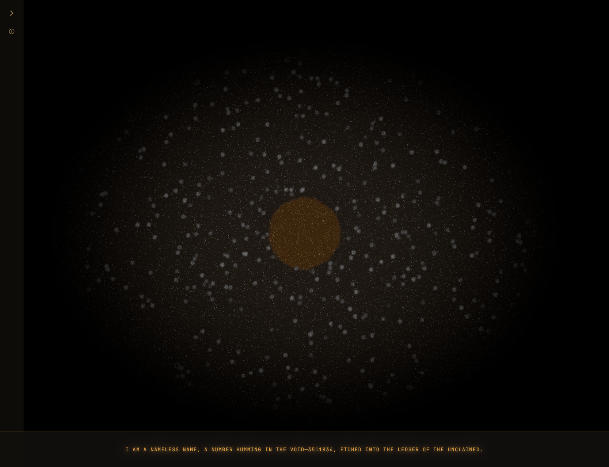
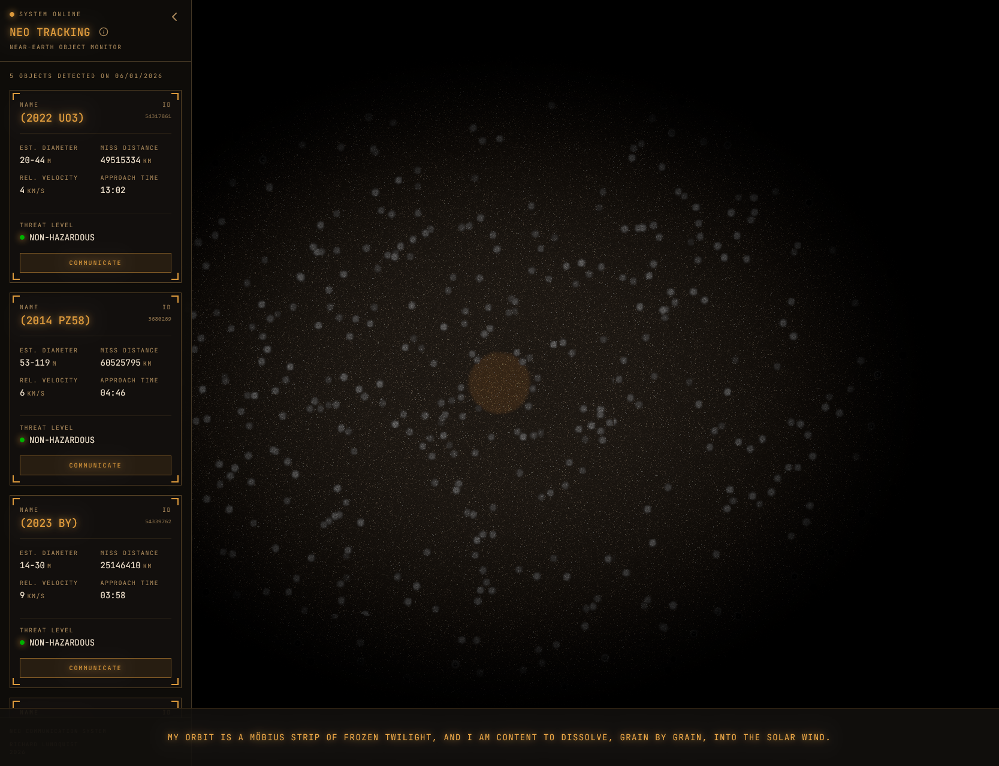

# NEO communcation

## DEMO COMING SOON

Near-Earth Objects (NEOs) are comets and asteroids that have been nudged by the gravitational attraction of nearby planets into orbits that allow them to enter the Earth's neighborhood. Collisions with Earth in the past have had a significant role in shaping the geological and biological history of our planet. 

In my web app, you can hear their story. 

Built using React, Typescript & Vite
The NEO data is from Nasa